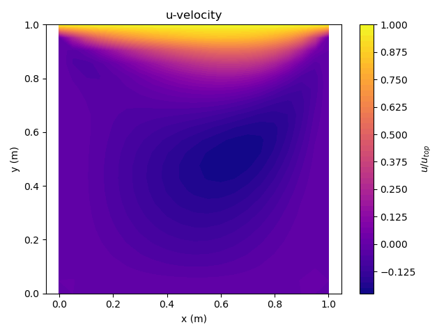

## u-velocity contour (lid-driven cavity) on a 20x20 grid

Dimensionless u-velocity field \(u/U_{\text{top}}\) for a
lid-driven cavity at \(Re = 100\). The solution is obtained
using a finite-volume SIMPLE algorithm with line-by-line TDMA.

